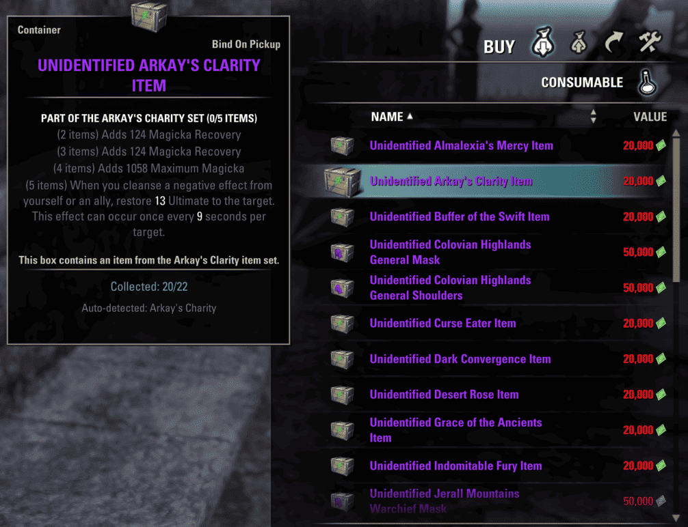
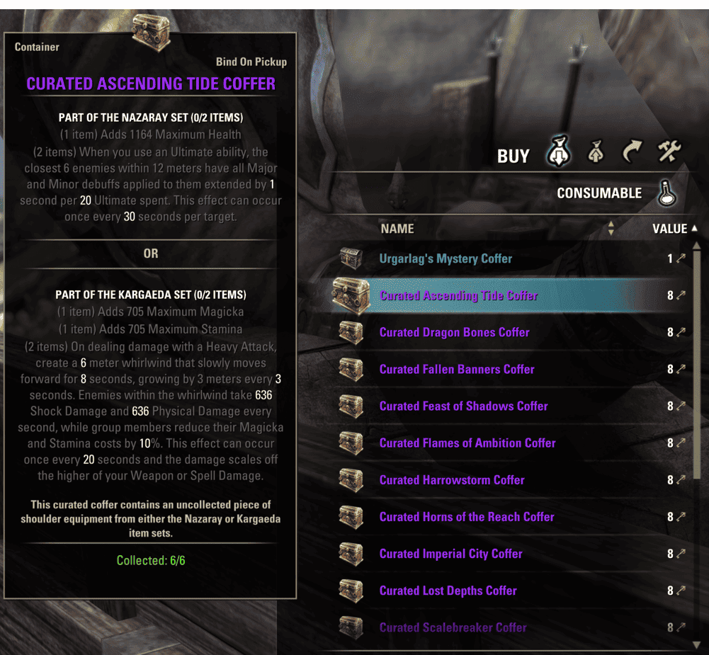
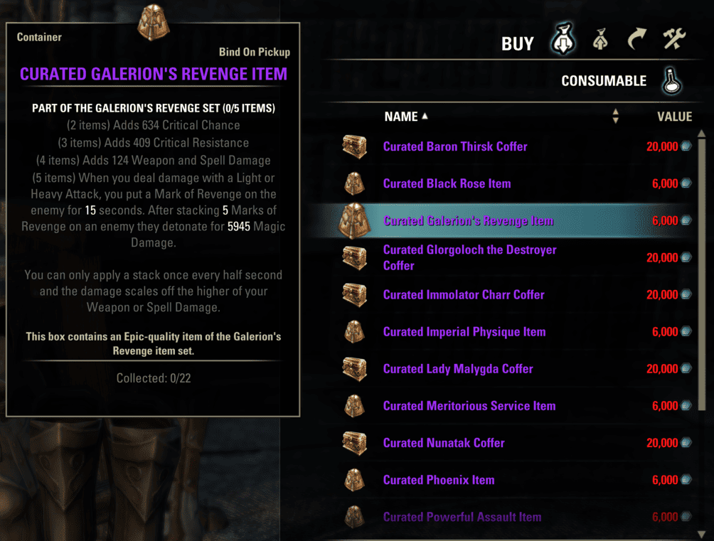

# Set Container Collector

Shows **account-wide set collection progress** on tooltips for equipment containers (coffers, lockboxes, unidentified gear boxes, zone bags, and similar items).

Hover a supported container in a vendor window, inventory, mail, trade UI, or gamepad tooltips on PC and see how many relevant set pieces you already have collected — for example `Collected: 2/3` for a monster shoulder coffer.

## Screenshots

Three examples across different vendors — complete (`6/6`), in progress with auto-detection, and not yet collected (`0/22`):

| Cyrodiil — AP Elite Gear Vendor | Undaunted — Curated Coffer | Imperial City — Tel Var Vendor |
|:---:|:---:|:---:|
|  |  |  |
| Partial progress on a registered vendor box (`20/22`). An unregistered single-set box shows the auto-detected set name (e.g. Arkay's Charity). | Shoulder pieces from both sets in the coffer, fully collected (`6/6`). | Tel Var curated gear box with no pieces collected yet (`0/22`). |

## Requirements

| Add-on | Required | Notes |
|--------|----------|-------|
| [LibSets](https://www.esoui.com/downloads/info2241-LibSets.html) | Yes (>=9020) | |
| [LibAddonMenu-2.0](https://www.esoui.com/downloads/info7-LibAddonMenu.html) | Yes (>=43) | |
| [AwesomeGuildStore](https://www.esoui.com/downloads/info695-AwesomeGuildStore.html) | Optional (>=3282) | Trading house tooltips |
| [LibSlashCommander](https://www.esoui.com/downloads/info3317-LibSlashCommander.html) | Optional | Slash command registration if installed (not listed in manifest) |

## Platform and UI

| Platform | Support |
|----------|---------|
| PC — keyboard and mouse | Full (tooltips, settings, slash commands) |
| PC — gamepad / controller UI | Tooltips supported (ZO `bodyDescription` styles; font size uses game defaults) |
| Xbox / PlayStation | Not supported (`.txt` manifest; add-on does not load on console) |

## Installation

1. Install dependencies (LibSets >=9020, LibAddonMenu-2.0 >=43).
2. Extract the `SetContainerCollector` folder into your `Documents/Elder Scrolls Online/live/AddOns/` directory.
3. Enable the add-on on the character select screen.

## Supported containers (v1.0.1)

- **Cyrodiil** — AP Elite Gear Vendor boxes; monster elite mask/shoulder containers (sets 711–713)
- **Imperial City** — Tel Var Armorer / Grand Armorer gear boxes and curated monster shoulder coffers
- **Undaunted** — Curated dungeon coffers; Maj / Glirion / Urgarlag Mystery Coffers
- **Battlegrounds** — Gladiator's Quarters weapon containers
- **Regional vendors** — Cyrodiil base camp zone bags (Alik'r, Auridon, … Craglorn)
- **Pools** — AP elite, Tel Var lockbox, Cyrodiil quartermaster drops (via LibSets)

Unlisted **single-set** containers can still work when **Auto-detect unregistered containers** is enabled (default: on). The add-on reads the game's container set API and infers monster shoulder coffers where applicable.

## Settings

**Settings → Add-ons → Set Container Collector**

| Option | Description |
|--------|-------------|
| Auto-detect unregistered containers | Resolve unknown set boxes via `GetItemLinkContainerSetInfo` |
| Tooltip font size | Size of the progress line on keyboard UI (12–28); disabled in gamepad-preferred mode |

## Slash commands
```
/scc pool <poolKey>       — print pool progress in chat
/scc debuglink <itemLink> — inspect how a container link is resolved
/scc                      — show pool command usage
```

Example pool keys: `maj_mystery`, `ap_elite`, `battleground_merchant`, `telvar`

## Localization

- English (`lang/en.lua`)
- Japanese (`lang/jp.lua`, loaded via `lang/$(language).lua` when the client language is Japanese)
- UI strings use ZO `SI_SCC_*` constants (`GetString`)

## License

[MIT](LICENSE) — Copyright (c) 2026 sivaDog

---

*This Add-on is not created by, affiliated with or sponsored by ZeniMax Media Inc.*
