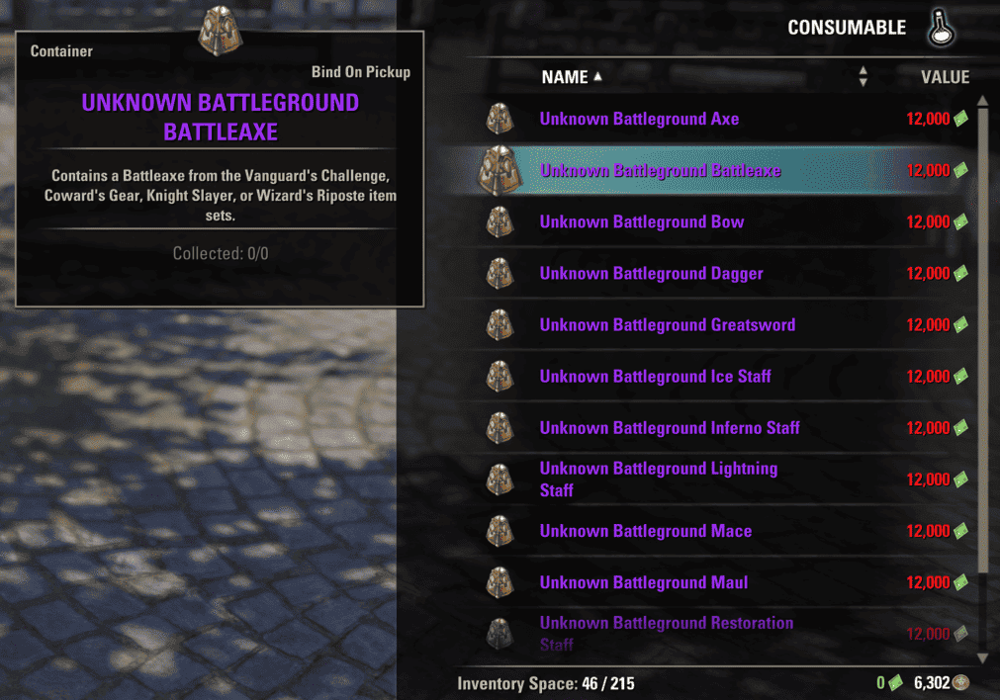

# Set Container Collector

Shows **account-wide set collection progress** on tooltips for equipment containers (coffers, lockboxes, unidentified gear boxes, zone bags, and similar items).

Hover a supported container in a vendor window, inventory, mail, or trade UI and see how many relevant set pieces you already have collected — for example `Collected: 2/3` for a monster shoulder coffer.

## Screenshots

### Cyrodiil — AP Elite Gear Vendor

Registered vendor boxes show collection progress. Unregistered single-set boxes can show an auto-detected set name.


### Undaunted — Curated Coffer

Curated dungeon coffers track shoulder pieces across both sets in the coffer (e.g. `6/6` when complete).


### Battlegrounds — Weapon Containers

Battleground weapon boxes filter progress by weapon type (shown here: `0/0` when no matching pieces apply to that weapon slot).



## Requirements

| Add-on | Required |
|--------|----------|
| [LibSets](https://www.esoui.com/downloads/info2241-LibSets.html) | Yes |
| [LibAddonMenu-2.0](https://www.esoui.com/downloads/info7-LibAddonMenu.html) | Yes |
| [LibSlashCommander](https://www.esoui.com/downloads/info3317-LibSlashCommander.html) | Optional (slash command registration) |
| [AwesomeGuildStore](https://www.esoui.com/downloads/info695-AwesomeGuildStore.html) | Optional (trading house tooltips) |

## Installation

1. Install dependencies (LibSets, LibAddonMenu-2.0).
2. Extract the `SetContainerCollector` folder into your `Documents/Elder Scrolls Online/live/AddOns/` directory.
3. Enable the add-on on the character select screen.

## Supported containers (v1.0.0)

- **Cyrodiil** — AP Elite Gear Vendor boxes; monster elite mask/shoulder containers (sets 711–713)
- **Imperial City** — Tel Var Armorer / Grand Armorer gear boxes and curated monster shoulder coffers
- **Undaunted** — Curated dungeon coffers; Maj / Glirion / Urgarlag Mystery Coffers
- **Battlegrounds** — Gladiator's Quarters weapon containers
- **Regional vendors** — Cyrodiil base camp zone bags (Alik'r, Auridon, … Craglorn)
- **Pools** — AP elite, Tel Var lockbox, Cyrodiil quartermaster drops (via LibSets)

Unlisted **single-set** containers can still work when **Auto-detect unregistered containers** is enabled (default: on). The add-on reads the game's container set API and infers monster shoulder coffers where applicable.

## Settings

**Settings → Add-ons → Set Container Collector**

| Option | Description |
|--------|-------------|
| Auto-detect unregistered containers | Resolve unknown set boxes via `GetItemLinkContainerSetInfo` |
| Tooltip font size | Size of the progress line (12–28) |

## Slash commands

```
/scc pool <poolKey>       — print pool progress in chat
/scc debuglink <itemLink> — inspect how a container link is resolved
/scc                      — show pool command usage
```

Example pool keys: `maj_mystery`, `ap_elite`, `battleground_merchant`, `telvar`

## Localization

- English (default)
- Japanese (`language/ja.lua`, loaded when the client language is Japanese)

## License

[MIT](LICENSE) — Copyright (c) 2026 sivaDog

---

*This Add-on is not created by, affiliated with or sponsored by ZeniMax Media Inc.*
